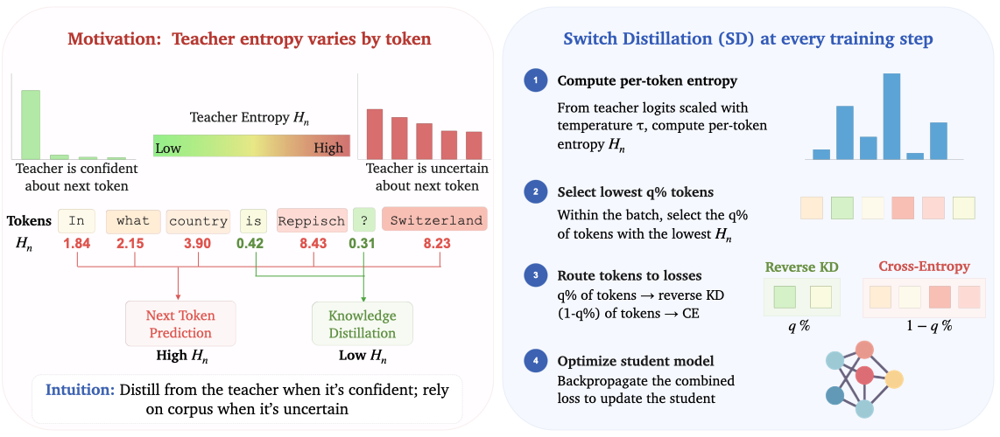

<p align="center">
  
</p>

This code is the official implementation of our paper, [Knowledge Distillation During Mid-Training Favors Reasoning over Factual Recall](). It includes code for pre-training and mid-training, as well as Switch Distillation, our proposed distillation method. 


Our code makes extensive use of [facebookresearch/lingua](https://github.com/facebookresearch/lingua) for pre-training and mid-training,
[allenai/open-instruct](https://github.com/allenai/open-instruct) for post-training, and [allenai/olmes](https://github.com/allenai/olmes) for evaluation.


## Layout

```
midtraining-distillation/
├── lingua/                   library (largely unchanged from upstream lingua)
├── apps/main/
│   ├── train.py              training driver + the three KD losses
│   └── configs/
│       ├── midtrain_recipes/ 4 mid-training recipes (28800 steps, from the 1B student init)
│       └── pretrain_recipes/ 3 from-scratch recipes (48000 steps, random init)
├── setup/                    data prep, HF↔Lingua checkpoint conversion
├── scripts/                  env.sh + sbatch launchers (the entry points)
├── post_training/            SFT → DPO → RLVR1 → RLVR2  (slurm scripts)
└── evaluation/               OLMES protocol             (spec + the two scorers)
```

Three separate environments are involved — training, OLMES, and open-instruct's
`uv` venv — because they pin incompatible vLLM/transformers versions. See each
subfolder's README.

## Recipes

All mid-training recipes share one canonical setup and differ **only** in the
teacher and the loss: OLMo-2-0425-1B student initialized from
`stage1-step1907359-tokens4001B`, Dolmino mid-training mix, 28800 steps
(~60B tokens), 4-node FSDP, bf16, FP8 teacher where applicable.

| Recipe | Loss |
|---|---|
| `ntp_baseline` | Vanilla next-token-prediction CE. No teacher. |
| `fkd` | Forward KL. `L = (1-a)*CE + a*T^2*KL(p_T||p_S)`, a=0.5, T=2. |
| `rkd` | Reverse KL (MiniLLM-style). `L = (1-a)*CE + a*T^2*KL(p_S||p_T)`, a=0.5, T=2. The KL-direction counterpart of `fkd`. |
| **`switch_distill`** | **The method.** Partitions tokens between CE and reverse KL by teacher entropy: `L = (1-m)*lam*CE + m*T^2*KL(p_S||p_T)`, `m = 1[H(p_T)<=tau]`. Low-entropy (confident-teacher) tokens get RKL; the rest get CE. q=0.20, lam=1, T=2. |

**The student is always the 1B model** (`OLMo-2-0425-1B`, initialized from
`stage1-step1907359-tokens4001B` for mid-training, random for from-scratch).
Only the teacher varies, and it is a parameter rather than part of the recipe:

```bash
RECIPE=switch_distill TEACHER=7b bash scripts/launch_midtrain.sh   # OLMo-2-1124-7B-Instruct (default)
RECIPE=fkd            TEACHER=1b bash scripts/launch_midtrain.sh   # OLMo-2-0425-1B-Instruct
RECIPE=fkd TEACHER_PATH=/path/to/any/hf/model bash scripts/launch_midtrain.sh
```

The paper reports both teacher sizes for `fkd` and `rkd` -- that is the
teacher-choice axis -- which is why teacher size is a flag rather than four
near-duplicate recipe files.

`τ` is the q-th quantile of teacher entropy, recomputed per batch. At q=0.20
the low-entropy 20% of tokens are distilled and the remaining 80% are trained
with cross-entropy.

The `pretrain_recipes/` are the from-scratch counterparts (`pt_ntp`,
`pt_fkd`, `pt_rkd`) at 48000 steps (~100B tokens) with
`init_ckpt_path: null`. Same loss, teacher, data, and token budget as
mid-training — only the initialization differs. That contrast is what shows the
reasoning–recall tradeoff is specific to the mid-training regime: it is a
KD-vs-NTP comparison, so there is no from-scratch `switch_distill` recipe.

## Quickstart

```bash
# 1. Environment (once).
conda create -n midtraining-distillation python=3.11 -y
conda activate midtraining-distillation
bash bin/install_requirements.sh      # pip deps, then torch 2.5.0 + xformers + flash-attn (cu121)

# 2. Configure paths. READ THIS FILE -- the four data/checkpoint roots have no
#    usable defaults, and the SLURM account/qos/partition are site-specific.
$EDITOR scripts/env.sh
source scripts/env.sh                 # required in every fresh shell

# 3. Data (~2 TB raw + ~2 TB shuffled; takes days on one node).
python setup/download_prepare_dolmino.py --data-dir ${DATA_ROOT} --memory 64

# 4. Teachers + student init (~24 GB). Needs a node with internet access.
bash scripts/fetch_models.sh           # or ONLY=student for just the student
python scripts/smoke_test.py           # asserts the HF→Lingua-DCP conversion is faithful
                                       # (a bad conversion trains silently to garbage)

# 5. Train.
RECIPE=switch_distill DRY_RUN=1 bash scripts/launch_midtrain.sh   # inspect the sbatch
RECIPE=switch_distill bash scripts/launch_midtrain.sh     # submit (4 nodes, ~56 h)
RECIPE=pt_ntp bash scripts/launch_pretrain.sh             # from-scratch instead

# 6. Convert a checkpoint back to HF for downstream use.
bash scripts/lingua_to_hf.sh ${MIDTRAIN_ROOT}/switch_distill/checkpoints/0000028800
python scripts/hf_generate.py ${MIDTRAIN_ROOT}/switch_distill/checkpoints/0000028800/hf
```

Checkpoints land in `${MIDTRAIN_ROOT}/<recipe>/checkpoints/<step>/`. The 1B
recipes need ~26 h on 4 nodes; the 7B-teacher recipes ~56 h.

In-training OLMES evaluation runs every 1200 steps via the `async_eval_gpus`
path and requires the separate OLMES env (`OLMES_CONDA_ENV`). Delete the
`eval:` block from a recipe YAML to turn it off.

