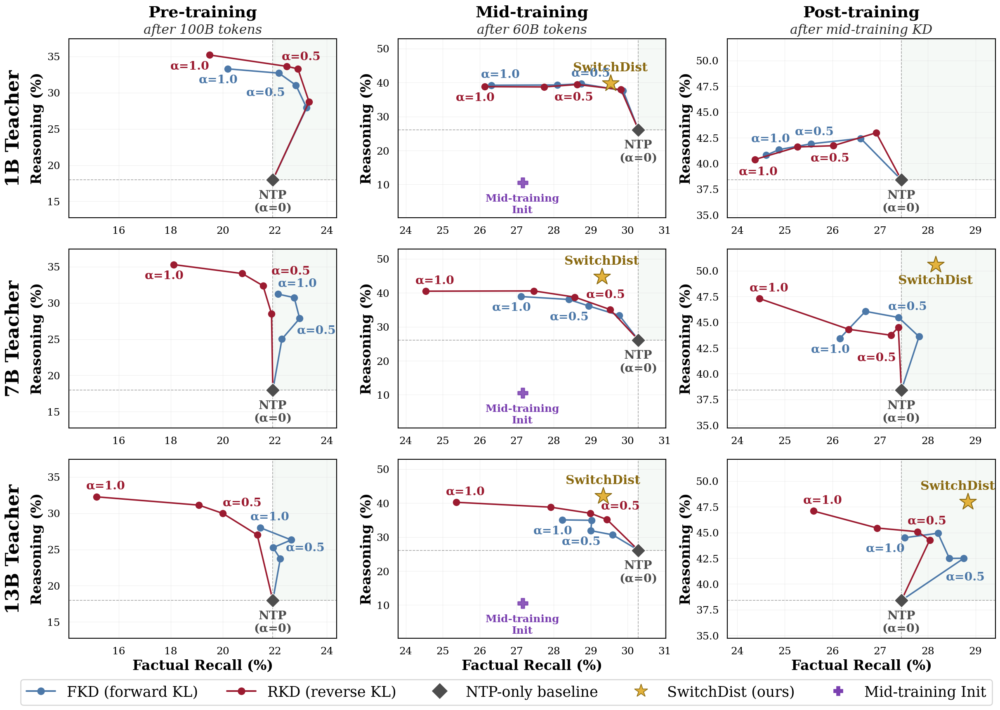

<p align="center">
  
</p>

This code is the official implementation of our paper, [Knowledge Distillation During Mid-Training Favors Reasoning over Factual Recall](https://arxiv.org/abs/2609.01532). It includes code for <b>Switch Distillation</b>, our proposed method that improves both reasoning and factual recall over standard KD during mid-training. A minimal implementation is shown below:

```python
import torch
import torch.nn.functional as F

def switch_distillation(s_logits, t_logits, labels, q=0.2, T=2.0):
    """
    Input:
        s_logits: Student logits, [batch, seq, vocab].
        t_logits: Teacher logits, [batch, seq, vocab].
        labels: Ground-truth token IDs, [batch, seq]; -100 = ignore.
        q: Fraction of lowest-entropy tokens routed to distillation.
        T: Distillation temperature.

    Output:
        Switch Distillation loss.
    """
    valid = labels != -100

    with torch.no_grad():
        t_logp = F.log_softmax(t_logits / T, -1)
        entropy = -(t_logp.exp() * t_logp).sum(-1)
        switch = (entropy <= torch.quantile(entropy[valid].float(), q)) & valid

    ce = F.cross_entropy(s_logits.transpose(1, 2), labels, reduction="none")
    s_logp = F.log_softmax(s_logits / T, -1)
    rkl = (s_logp.exp() * (s_logp - t_logp)).sum(-1) * T**2

    return ce[valid & ~switch].mean() + rkl[switch].mean()
```

This repository also contains training and evaluation code to replicate the experiments in our paper.

## Getting Started

```bash
# 1. Environment (once).
conda create -n midtraining-distillation python=3.11 -y
conda activate midtraining-distillation
bash bin/install_requirements.sh      # pip deps, then torch 2.5.0 + xformers + flash-attn (cu121)

# 2. Configure paths in env.sh.
vim scripts/env.sh
source scripts/env.sh                 # required in every fresh shell

# 3. Download and prepare Dolmino data (~2 TB raw + ~2 TB shuffled).
python setup/download_prepare_dolmino.py --data-dir ${DATA_ROOT} --memory 64

# 4. Teachers + student download and lingua conversion.
bash scripts/fetch_models.sh           # or ONLY=student for just the student
python scripts/smoke_test.py           # asserts that HF→Lingua-DCP conversion is working properly
```

## Reasoning-Recall Tradeoff
<p align="center">
  
</p>

As shown in the plot, KD exhibits a **stage-dependent** tradeoff. At the
mid-training budget, recipes that gain on reasoning (GSM8K, DROP, MATH)
systematically give up ground on factual recall (TriviaQA, Natural Questions)
relative to next-token prediction on the same data and token budget. The same
recipes trained from scratch do not show this cost, which is what makes the
tradeoff specific to mid-training rather than a property of KD itself.

Switch Distillation targets that cost directly: by routing only the
lowest-entropy tokens to reverse KL and leaving the rest on cross-entropy, it
recovers recall relative to standard KD while keeping the reasoning gains. The
training and evaluation scripts below reproduce both halves of this comparison.

## Reproducing the Experiments

### 1. Pre-training

Our pre-training and mid-training code builds on
[facebookresearch/lingua](https://github.com/facebookresearch/lingua).

`apps/main/configs/pretrain_recipes/` contains the from-scratch baselines: `pt_ntp`, `pt_fkd`,
and `pt_rkd`. We randomly initialize an `OLMo-2-0425-1B` student
(`init_ckpt_path: null`) and train on the Dolmino mix for 48,000 steps (~100B tokens).

| Recipe | Objective |
|---|---|
| `pt_ntp` | Standard next-token prediction (CE); no teacher. |
| `pt_fkd` | Forward KL: $L = (1-\alpha)\mathrm{CE} + \alpha T^2 D_{\mathrm{KL}}(p_T \Vert p_S)$, with $\alpha=0.5, T=2$. |
| `pt_rkd` | Reverse KL: $L = (1-\alpha)\mathrm{CE} + \alpha T^2 D_{\mathrm{KL}}(p_S \Vert p_T)$, with $\alpha=0.5, T=2$. |

Launch pre-training experiments with:

```bash
RECIPE=pt_ntp bash scripts/launch_pretrain.sh
RECIPE=pt_fkd TEACHER=7b bash scripts/launch_pretrain.sh
RECIPE=pt_rkd TEACHER=7b bash scripts/launch_pretrain.sh
```

### 2. Mid-training

All mid-training recipes use the same setup and differ only in the training
objective and teacher. We initialize an `OLMo-2-0425-1B` student from
`stage1-step1907359-tokens4001B` and train on the Dolmino mix for
28,800 steps (~60B tokens).

| Recipe | Objective |
|---|---|
| `ntp_baseline` | Standard next-token prediction (CE); no teacher. |
| `fkd` | Forward KL: $L = (1-\alpha)\,\mathrm{CE} + \alpha T^2\,D_{\mathrm{KL}}(p_T \Vert p_S)$, with $\alpha=0.5, T=2$. |
| `rkd` | Reverse KL: $L = (1-\alpha)\,\mathrm{CE} + \alpha T^2\,D_{\mathrm{KL}}(p_S \Vert p_T)$, with $\alpha=0.5, T=2$. |
| **`switch_distill`** | **Switch Distillation (ours):** routes the lowest-entropy $q$ fraction of tokens to reverse KL and the remainder to CE. We use $q=0.20, T=2$. |

The student is always `OLMo-2-0425-1B`; teacher choice is configured
separately:

```bash
RECIPE=switch_distill TEACHER=7b bash scripts/launch_midtrain.sh
RECIPE=fkd            TEACHER=1b bash scripts/launch_midtrain.sh
RECIPE=fkd TEACHER_PATH=/path/to/any/hf/model bash scripts/launch_midtrain.sh
```

### 3. Post-training
We use [allenai/open-instruct](https://github.com/allenai/open-instruct) for standard post-training of all models.
Post-training runs the OLMo-2 1B recipe (Tulu-3 SFT → DPO → RLVR1 → RLVR2) on
top of any mid-training checkpoint, which is how we check whether the
mid-training gains survive alignment.
See [`post_training/README.md`](post_training/README.md) for setup and reproduction details.

### 4. Evaluation

Evaluation uses [olmes](https://github.com/allenai/olmes) at a pinned SHA in its
own conda env. `evaluation/scripts/run_evals.sh` runs the canonical suite,
grouped into the categories we report (reasoning, knowledge, factual recall,
instruction following). See [`evaluation/README.md`](evaluation/README.md) for
setup and the per-stage task aliases.

## Acknowledgements

This repository builds on several open-source projects:
[facebookresearch/lingua](https://github.com/facebookresearch/lingua) for
pre-training and mid-training, [allenai/open-instruct](https://github.com/allenai/open-instruct)
for post-training, and [allenai/olmes](https://github.com/allenai/olmes) for
evaluation. Training data comes from
[allenai/dolmino-mix-1124](https://huggingface.co/datasets/allenai/dolmino-mix-1124),
and the student and teacher checkpoints are the
[OLMo-2](https://huggingface.co/collections/allenai/olmo-2) releases. Portions of
`setup/convert_consolidated_lingua_ckpt_to_hf.py` derive from Apache-2.0 code by
EleutherAI and HuggingFace; that notice is retained in the file.

## License

This project is MIT licensed — see [LICENSE](LICENSE).

## Citation
If you find this work useful, please cite:

```bibtex
@article{he2026knowledge,
  title={Knowledge Distillation During Mid-Training Favors Reasoning over Factual Recall},
  author={He, Jacqueline and Yen, Howard and Li, Shuyue Stella and Li, Margaret and Zeng, Hanqing and Xia, Yinglong and Zhang, Benyu and Zhao, Zhuokai and Zhang, Qiang and Koh, Pang Wei and Zettlemoyer, Luke and Yih, Wen-tau},
  year={2026}
}
```
